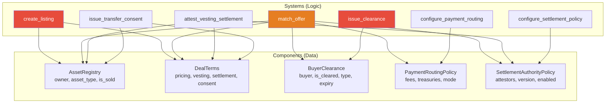

# Relay Protocol — Smart Contract Security Audit

**Date**: 2026-04-02  
**Scope**: All 12 on-chain programs in `programs-ecs/` (5 components, 7 systems)  
**Framework**: BOLT ECS (bolt-lang 0.2.4) on Anchor 0.32.1  

---

## Executive Summary

The Relay protocol implements a **private OTC liquidity layer** for illiquid assets on Solana using BOLT's Entity-Component-System architecture. The contracts are well-structured with strong input validation and a clear separation between data (components) and logic (systems).

**Overall Assessment**: The codebase demonstrates solid engineering fundamentals. Arithmetic overflow protection is enabled at the workspace level, and business-logic validation is thorough. However, several **medium-to-high severity** issues exist around access control, timestamp trust, and state machine transitions that should be addressed before mainnet deployment.

| Severity | Count |
|----------|-------|
| 🔴 Critical | 1 |
| 🟠 High | 3 |
| 🟡 Medium | 5 |
| 🔵 Informational | 5 |

---

## 🔴 Critical Findings

### C-1: `issue_clearance` Has No Access Control

**File**: [lib.rs](file:///c:/Users/ezevi/Documents/Relay/programs-ecs/systems/issue_clearance/src/lib.rs)  
**Lines**: 33–50

The `issue_clearance` system sets `is_cleared = true` for any buyer without checking **who** is calling the instruction. Any wallet can grant accredited-investor clearance to any buyer.

```rust
// No authority check — anyone can call this
let buyer_clearance = &mut ctx.accounts.buyer_clearance;
buyer_clearance.buyer = buyer;
buyer_clearance.is_cleared = true;     // ← unconditionally grants clearance
buyer_clearance.clearance_type = args.clearance_type;
buyer_clearance.expires_at = args.expires_at;
```

**Impact**: Completely bypasses the compliance gate. An attacker can self-clear and then call `match_offer` to purchase any listing.

**Recommendation**: Add an authorized clearance authority (e.g., a TEE signer or admin keypair) and validate `ctx.accounts.authority.key` against it. Consider a protocol-level `ClearanceAuthorityPolicy` component (similar to [SettlementAuthorityPolicy](file:///c:/Users/ezevi/Documents/Relay/programs-ecs/shared/component_types/src/lib.rs#59-68)) to manage allowed clearance issuers.

---

## 🟠 High Findings

### H-1: `create_listing` Has No Owner Authorization

**File**: [lib.rs](file:///c:/Users/ezevi/Documents/Relay/programs-ecs/systems/create_listing/src/lib.rs)  
**Lines**: 100–216

The `owner` is passed as a **string argument**, not derived from the transaction signer. Any caller can create a listing on behalf of any wallet, setting `asset_registry.owner = owner` to an arbitrary pubkey.

```rust
let owner = Pubkey::from_str(&args.owner)
    .map_err(|_| error!(CreateListingError::InvalidOwner))?;
// ...
asset_registry.owner = owner;  // ← no check that ctx.accounts.authority == owner
```

**Impact**: Spoofed listings could mislead buyers into paying the attacker. The seller payout in `match_offer` goes to `asset_registry.owner`, so if the real owner didn't create the listing, the attacker wouldn't directly receive funds—but it enables social engineering and protocol abuse.

**Recommendation**: Either enforce `ctx.accounts.authority.key == &owner` or remove the `owner` arg and always use `*ctx.accounts.authority.key`.

---

### H-2: Client-Supplied Timestamp Enables Expiry Bypass

**Files**:
- [match_offer/lib.rs](file:///c:/Users/ezevi/Documents/Relay/programs-ecs/systems/match_offer/src/lib.rs) — Lines 144–149, 178–183, 195–200
- [attest_vesting_settlement/lib.rs](file:///c:/Users/ezevi/Documents/Relay/programs-ecs/systems/attest_vesting_settlement/src/lib.rs) — Line 116

All expiry checks use `args.current_timestamp`, which the caller controls. A buyer can pass `current_timestamp = 0` to bypass **all** time-based expiry guards because of this pattern:

```rust
if buyer_clearance.expires_at > 0 && args.current_timestamp > 0 {
    require!(
        (args.current_timestamp as u64) < buyer_clearance.expires_at,
        MatchOfferError::ClearanceExpired
    );
}
```

When `current_timestamp` is `0` (the default), the entire `if` block is skipped.

**Impact**: Expired clearances, expired settlements, and expired consents can all be used indefinitely by simply not supplying a timestamp.

**Recommendation**: Use the Solana `Clock` sysvar (`clock::Clock::get()?.unix_timestamp`) instead of client-supplied timestamps. If the BOLT ECS abstraction prevents sysvar access, enforce `current_timestamp > 0` at the system level and compare against a reasonable minimum epoch.

---

### H-3: `match_offer` Does Not Verify Buyer is the Transaction Signer

**File**: [lib.rs](file:///c:/Users/ezevi/Documents/Relay/programs-ecs/systems/match_offer/src/lib.rs)  
**Lines**: 107–108

The `buyer` pubkey is taken from the JSON args, but the SOL transfer uses `authority.key` as the payer. There is no guarantee that `buyer == authority`. This means:
- The `authority` (signer) pays the SOL, but the `buyer` (from args) receives ownership.
- A front-running attacker could observe a pending match TX and submit their own with the same args but a different `buyer` field.

```rust
let buyer = Pubkey::from_str(&args.buyer)
    .map_err(|_| error!(MatchOfferError::InvalidArgs))?;
// ...
// SOL is transferred from authority, but buyer gets ownership:
asset_registry.owner = buyer;
```

**Recommendation**: Enforce `buyer == *ctx.accounts.authority.key` or make the buyer always the signer.

---

## 🟡 Medium Findings

### M-1: Listings Cannot Be Cancelled or Updated

**All system contracts**

There is no system for a seller to:
- Cancel/delist an active listing
- Update the price, vesting details, or other terms
- Revoke a clearance

Once created, a listing can only be consumed via `match_offer`. A seller who listed at the wrong price or who no longer wishes to sell has no recourse on-chain.

**Recommendation**: Add `cancel_listing` and `update_listing` system contracts with proper owner authorization.

---

### M-2: Clearance Is Not Entity-Scoped

**File**: [issue_clearance/lib.rs](file:///c:/Users/ezevi/Documents/Relay/programs-ecs/systems/issue_clearance/src/lib.rs)

A single [BuyerClearance](file:///c:/Users/ezevi/Documents/Relay/programs-ecs/components/buyer_clearance/src/lib.rs#12-22) component, once set, acts as a global pass. `match_offer` only checks `is_cleared` and `buyer` match—it doesn't verify the clearance was issued for the specific listing entity. A buyer cleared for one deal can use that clearance for any deal.

**Impact**: Violates the principle of least privilege for compliance gates. A buyer qualified for a $1M deal could use the same clearance for a $100M deal.

**Recommendation**: Scope clearance to specific listing entities, or add a `listing_entity` field to [BuyerClearance](file:///c:/Users/ezevi/Documents/Relay/programs-ecs/components/buyer_clearance/src/lib.rs#12-22) and validate it in `match_offer`.

---

### M-3: Re-Initialization of Components Not Guarded

**Files**: All system contracts

BOLT components rely on PDA derivation for uniqueness, but the system contracts don't check if a component is already initialized before overwriting. For example, `create_listing` unconditionally writes to `asset_registry` and `deal_terms` without checking if they already have data.

Similarly, `issue_clearance` can be called repeatedly to overwrite existing clearance data (e.g., changing `clearance_type` or extending `expires_at`).

**Impact**: An attacker could re-initialize a listing after it's been sold (setting `is_sold = false`) or downgrade a buyer's clearance.

**Recommendation**: Add initialization guards (e.g., check `asset_registry.owner == Pubkey::default()` before creation, and prevent `is_sold` from being reset).

---

### M-4: No Rate Limiting or Cooldown on Nonce-Based Approvals

**Files**: [attest_vesting_settlement](file:///c:/Users/ezevi/Documents/Relay/programs-ecs/systems/attest_vesting_settlement/src/lib.rs), [issue_transfer_consent](file:///c:/Users/ezevi/Documents/Relay/programs-ecs/systems/issue_transfer_consent/src/lib.rs)

Both systems use monotonic nonces to prevent replay, but there is no cooldown or rate limit. An authorized attestor can issue back-to-back approvals for different buyers, constantly overwriting the `approved_buyer`.

**Impact**: In a race condition, an attestor could switch the approved buyer right before a `match_offer` transaction finalizes, causing an honest buyer's TX to fail.

**Recommendation**: Consider a minimum time window between approval switches, or allow multiple concurrent approvals.

---

### M-5: `i64` → `u64` Cast for Timestamp Comparison

**File**: [match_offer/lib.rs](file:///c:/Users/ezevi/Documents/Relay/programs-ecs/systems/match_offer/src/lib.rs)  
**Lines**: 146, 180, 197

`current_timestamp` is declared as `i64` but cast to `u64` in comparisons without checking for negative values:

```rust
(args.current_timestamp as u64) < buyer_clearance.expires_at
```

A negative `current_timestamp` would wrap to a very large `u64`, causing the comparison to always succeed (bypassing the expiry check).

**Recommendation**: Validate `args.current_timestamp >= 0` before casting, or change the type to `u64`.

---

## 🔵 Informational Findings

### I-1: Duplicated [attestor_is_allowed](file:///c:/Users/ezevi/Documents/Relay/programs-ecs/systems/match_offer/src/lib.rs#79-84) and [parse_optional_pubkey](file:///c:/Users/ezevi/Documents/Relay/programs-ecs/systems/create_listing/src/lib.rs#82-89) Functions

The helper functions [attestor_is_allowed](file:///c:/Users/ezevi/Documents/Relay/programs-ecs/systems/match_offer/src/lib.rs#79-84) and [parse_optional_pubkey](file:///c:/Users/ezevi/Documents/Relay/programs-ecs/systems/create_listing/src/lib.rs#82-89) are duplicated across multiple system crates. Consider extracting them into the `relay_component_types` shared crate.

### I-2: No Event Emission

None of the system contracts emit Anchor events. This makes off-chain indexing, monitoring, and forensic analysis significantly harder. Consider emitting events for all state transitions (listing created, matched, clearance issued, etc.).

### I-3: `overflow-checks = true` Only in Release Profile

[Cargo.toml](file:///c:/Users/ezevi/Documents/Relay/Cargo.toml) enables `overflow-checks` only in `[profile.release]`. Debug/test builds won't catch overflow bugs. The [compute_fee](file:///c:/Users/ezevi/Documents/Relay/programs-ecs/systems/match_offer/src/lib.rs#85-92) function in `match_offer` has its own checked arithmetic, but other arithmetic ops rely on the profile setting.

### I-4: Hardcoded Asset Type Magic Numbers

Asset types (1-6), clearance types (1-3), settlement modes (0-3), settlement statuses (0-3), consent statuses (0-3), and transfer restriction modes (0-2) are all raw `u8` values. Using named constants or enums with `TryFrom` would improve readability and prevent invalid state transitions.

### I-5: No On-Chain Test Coverage

The only existing test file ([request-validation.test.ts](file:///c:/Users/ezevi/Documents/Relay/tests/request-validation.test.ts)) covers server-side request parsing, not the on-chain programs themselves. There are no Anchor integration tests for any of the 7 system contracts.

**Recommendation**: Write Anchor/Bankrun integration tests covering:
- Happy-path flows for all system contracts
- Access control failures
- Expiry and nonce edge cases
- Re-initialization attacks
- Payment routing fee edge cases (100% fees, 0 fees, etc.)

---

## Architecture Diagram



> Red = critical/high access control issues. Orange = high timestamp trust issue.

---

## Summary of Recommendations (Priority Order)

| Priority | Finding | Fix |
|----------|---------|-----|
| 🔴 P0 | C-1: `issue_clearance` open to anyone | Add authority check + clearance authority policy |
| 🟠 P0 | H-2: Client timestamp bypass | Use `Clock` sysvar or enforce `> 0` |
| 🟠 P1 | H-1: Listing owner spoofing | Enforce `authority == owner` |
| 🟠 P1 | H-3: Buyer not verified as signer | Enforce `buyer == authority` |
| 🟡 P1 | M-3: Re-initialization attacks | Add initialization guards |
| 🟡 P1 | M-5: Negative timestamp cast | Validate `>= 0` before `u64` cast |
| 🟡 P2 | M-1: No cancel/update listing | Add new system contracts |
| 🟡 P2 | M-2: Clearance not entity-scoped | Scope to listing entities |
| 🟡 P2 | M-4: No approval cooldown | Add time-window or multi-approval |
| 🔵 P3 | I-1–I-5: Code quality | Extract shared utils, add events, tests, enums |
