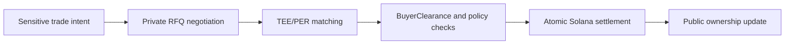

# Relay

Relay is a private OTC and secondary market liquidity layer for Solana.

It enables confidential negotiation and atomic settlement for markets where public intent is expensive:

- Private secondary markets for SAFTs, SAFEs, vested tokens, and locked allocations.
- Private OTC desks for liquid token blocks, treasury sales, whale-to-whale deals, and project or market maker coordination.

Relay is designed for counterparties that need to discover price without broadcasting intent, size, strategy, or private transfer terms before settlement.

> **Relay in one line:** private negotiation for sensitive assets and token blocks, with final settlement on Solana.

## Why Now

Solana has become a credible settlement layer for high-throughput financial activity, but a large share of institutional liquidity still clears through private messages, manual OTC desks, and fragmented legal workflows.

That gap exists because public venues expose too much before a trade is complete.

| Market | What needs privacy | Why public execution breaks down |
| --- | --- | --- |
| Private secondaries | Transfer terms, buyer eligibility, vesting schedules | Public signaling can create reputational, compliance, and market impact risk. |
| Token block trades | Size, direction, price limits, counterparty intent | Public order flow can move the market before execution. |
| Treasury OTC | Seller identity, timing, negotiated price | Premature disclosure can create governance and market pressure. |
| Market maker coordination | Inventory needs, project strategy, allocation size | Strategy leaks reduce execution quality and negotiating leverage. |

Relay exists because Solana can settle these transactions, but the negotiation layer needs to be private.

## Why Relay Wins

Relay is not another public venue. It is the missing private coordination layer between off-chain institutional negotiation and on-chain settlement.

| Requirement | Traditional OTC | Public DEX / AMM | Relay |
| --- | --- | --- | --- |
| Private negotiation | Yes | No | Yes |
| Atomic on-chain settlement | Usually no | Yes | Yes |
| Transfer controls | Manual | Limited | Programmatic `BuyerClearance` |
| Reduced information leakage | Yes | No | Yes |
| Solana-native execution path | No | Yes | Yes |

Relay combines the privacy discipline of OTC markets with Solana-native settlement.

## Why Relay Exists

Public markets are efficient when intent can be public. They are fragile when intent itself becomes market-moving information.

Large OTC trades, treasury sales, restricted transfers, and private secondaries often happen through manual off-chain workflows because on-chain negotiation exposes too much:

- Order size and direction.
- Minimum price and negotiation range.
- Buyer identity and eligibility.
- Issuer restrictions and transfer conditions.
- Treasury or market maker strategy.

Relay moves negotiation into a private execution environment and keeps settlement on Solana.

## What Relay Provides

Relay combines:

- **Confidential RFQ matching** inside TEE-backed Private Ephemeral Rollups.
- **Atomic settlement** back to Solana.
- **BOLT ECS split-state architecture** with public ownership state and confidential deal state.
- **BuyerClearance** for eligibility and transfer controls.
- **A gasless relayer pattern** that abstracts infrastructure setup while keeping execution non-custodial.

The result is a private liquidity layer for trades where information leakage is the main execution risk.


Relay's wedge is not "more liquidity" in the abstract. It is private liquidity for counterparties who cannot safely reveal intent before settlement.


## Protocol Status

Relay is currently an MVP and development-stage protocol running against Solana Devnet and local MagicBlock execution environments.

The current implementation includes:

- `create_listing`
- `match_offer`
- `issue_clearance`
- `attest_vesting_settlement`
- `issue_transfer_consent`
- `cancel_listing`
- BOLT components for `AssetRegistry`, `DealTerms`, `BuyerClearance`, payment routing, and settlement authority policy.

Relay is not a public token sale, not a broker-dealer, and not a custodial exchange.

## Start Here

- Read [Relay in 90 Seconds](getting-started/relay-in-90-seconds.md)
- Read [What Is Relay?](getting-started/what-is-relay.md)
- Review the [Private Secondary Market](product/private-secondary-market.md)
- Review the [Private OTC Desk](product/private-otc-desk.md)
- Understand the [Architecture](protocol/architecture.md)
- Run the [Devnet MVP](builders/devnet-mvp.md)
