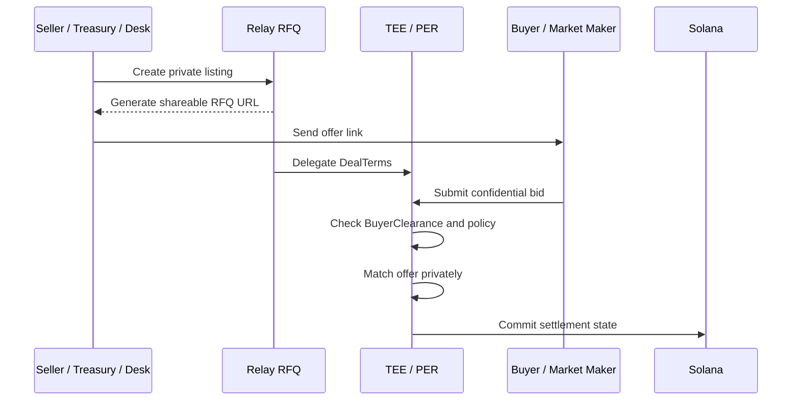

# Relay in 90 Seconds

Relay is a private liquidity layer for Solana.

It is built for trades where the market should see the settlement, not the negotiation.

## The Problem

Some trades lose value the moment they become visible:

- A treasury sale can look like distress.
- A whale block can move markets before execution.
- A founder or employee secondary can signal insider selling.
- A SAFT, SAFE, or locked allocation transfer can expose private legal and eligibility terms.
- Market maker coordination can reveal inventory strategy.

Public venues are not designed for these flows. Traditional OTC desks handle them privately, but settlement remains fragmented, manual, and trust-heavy.

## The Relay Answer

Relay gives these workflows a private RFQ layer with Solana settlement.

## What Relay Unlocks

| Product path | Assets and trades | Primary buyer |
| --- | --- | --- |
| Private secondary market | SAFTs, SAFEs, vested tokens, locked allocations | Funds, private buyers, issuers, employees |
| Private OTC desk | Token blocks, treasury sales, whale-to-whale trades | Desks, market makers, treasuries, large holders |

## Why It Matters

Relay sits at the intersection of three market shifts:

1. **Solana is ready for institutional settlement.** High-throughput rails make atomic settlement practical.
2. **Private crypto markets are becoming larger and more structured.** Vested allocations, treasury sales, and OTC blocks need better infrastructure.
3. **Information leakage is now a core execution problem.** Public intent can move prices, trigger narratives, and reduce negotiating leverage.

## Why Relay Can Win

Relay's advantage is the combination:

- Solana-native settlement.
- Private RFQ negotiation.
- Shareable offer URLs for direct counterparty distribution.
- BOLT ECS split-state architecture.
- MagicBlock Private Ephemeral Rollups.
- TEE-backed matching.
- BuyerClearance and transfer controls.

Most venues optimize for public liquidity. Relay optimizes for confidential liquidity.


Relay is the private execution layer for the trades that should not start in public order flow.

