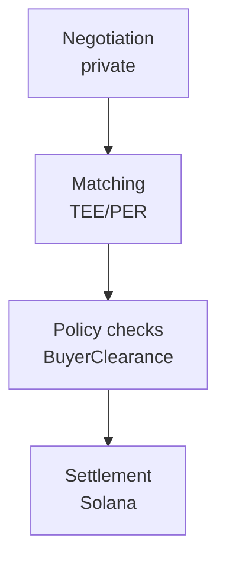

# What Is Relay?

Relay is a private liquidity layer for Solana.

It gives counterparties a confidential RFQ environment where they can negotiate terms, verify eligibility, and settle atomically without exposing sensitive deal information to the public market before execution.

## The Short Version

| Question | Answer |
| --- | --- |
| What does Relay do? | Private RFQ negotiation and atomic Solana settlement. |
| Who is it for? | Funds, desks, treasuries, market makers, founders, employees, and private buyers. |
| What assets does it support? | SAFTs, SAFEs, vested tokens, locked allocations, and liquid token blocks. |
| What is the wedge? | Reduce information leakage before settlement. |
| What is the protocol primitive? | Confidential `DealTerms`, public `AssetRegistry`, and `BuyerClearance` inside a TEE/PER flow. |

## The Core Idea

Relay separates negotiation from settlement.

- Negotiation happens privately inside MagicBlock Private Ephemeral Rollups backed by TEEs.
- Settlement commits the final ownership state back to Solana.

This allows participants to keep sensitive deal information private while preserving the auditability and finality of public-chain settlement.

## Two Product Paths

Relay supports two related liquidity paths.

### Private Secondary Market

For illiquid or restricted assets:

- SAFTs
- SAFEs
- Vested tokens
- Locked allocations
- Agreement-backed private positions

This path helps sellers access liquidity and buyers evaluate private opportunities without making transfer terms public.

### Private OTC Desk

For liquid token block trades:

- Treasury OTC sales
- Whale-to-whale deals
- Market maker and project coordination
- Confidential buyer and seller matching
- Private token block trades

This path helps counterparties discover price without broadcasting size, direction, or intent.

## Why Relay Is Different

Relay is not trying to make every trade private. It is focused on trades where private negotiation is economically necessary.

| Category | Public venue | Relay |
| --- | --- | --- |
| Small spot swap | Best fit | Not the primary use case |
| Large token block | Leaks intent | Private RFQ and atomic settlement |
| Treasury sale | Can trigger public pressure | Confidential buyer matching |
| Vested allocation | Hard to transfer publicly | Transfer controls and private terms |
| Market maker coordination | Strategy leakage | Private negotiation path |

## What Relay Is Not

Relay is not:

- A public AMM.
- A token launchpad.
- A custody provider.
- A public token sale.
- A replacement for legal, tax, or compliance advice.

Relay is infrastructure for private negotiation and atomic settlement.


Relay is currently a development-stage MVP. Mainnet operation, legal workflows, and production KYC integrations require additional review before production use.

