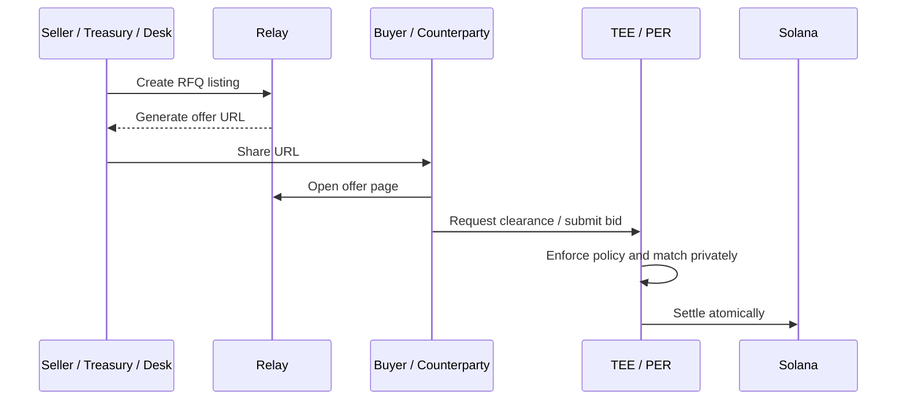

# Shareable RFQ Links

Relay listings are designed to be portable.

When a seller, treasury, desk, or issuer creates an offer, Relay can generate a direct offer URL that opens the exact RFQ detail page for that listing.

This turns every listing into a private deal room that can be shared with the intended counterparty.

## Why This Matters

OTC markets do not start with a public order book. They usually start with a conversation.

A seller may already know the right buyer. A treasury may be coordinating with a specific desk. A market maker may need a direct route into a project allocation. A founder may be sending a secondary opportunity to an approved private buyer.

Shareable RFQ links make that workflow natural:

1. Create the offer.
2. Copy the generated URL.
3. Send it to the counterparty.
4. The counterparty opens the offer page directly.
5. Relay handles clearance, matching, and settlement through the normal RFQ flow.

## Public vs Private Distribution

| Distribution mode | How the link is used | Best fit |
| --- | --- | --- |
| Direct private link | Seller sends the URL to one buyer, desk, or market maker | Reserved placements, bilateral OTC, issuer-approved transfers |
| Selective desk distribution | Desk shares the URL with a small buyer list | Treasury sales, block trades, strategic allocation |
| Public market listing | URL is visible from the Relay market page | Open secondary liquidity and public RFQ discovery |

The URL improves distribution, but it does not bypass the protocol.

If the listing requires `BuyerClearance`, transfer consent, settlement attestation, or a reserved buyer, those checks still apply before matching.

## Buyer Experience

A buyer who opens a shareable RFQ link sees the placement detail page:

- Asset type.
- Minimum price.
- Token amount or position size.
- Transfer policy.
- Settlement status.
- Public `AssetRegistry` reference.
- Confidential `DealTerms` notice.
- Required pre-match checklist.
- Match offer action when eligible.

The buyer does not need to search the market page or manually enter a listing ID.

## Seller Experience

After creating an offer, the seller receives a generated URL such as:

```text
https://app.relay.example/trade_detail/1234567890
```

The seller can copy the URL and share it through the appropriate channel.


The link is a routing convenience, not a trust shortcut. The protocol still enforces buyer clearance, transfer restrictions, and settlement requirements.


## Privacy Model

Shareable URLs are useful because they reduce coordination friction, but operators should treat them carefully.

The URL may reveal that a listing exists to anyone who receives it. It should be distributed according to the sensitivity of the transaction.

For highly sensitive flows, use direct distribution to known counterparties. For broader RFQ discovery, use the market page.

## Workflow Diagram



## Operational Guidance

- Use reserved buyer mode for one-to-one private placements.
- Use listing-scoped `BuyerClearance` when a buyer should only be approved for one offer.
- Avoid sharing sensitive RFQ links in public channels unless the offer is intended for broad discovery.
- Treat screenshots, wallet labels, and timing as potentially sensitive metadata.
- Rotate or cancel and relist if a link was distributed too broadly.
