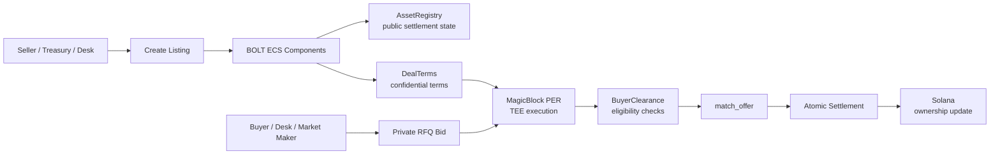

# Architecture

Relay uses split-state execution.

Public settlement state remains verifiable on Solana. Confidential negotiation state stays inside the Private Ephemeral Rollup.

## Core Layers

### Solana Base Layer

Solana is the settlement layer. Final ownership and public protocol state are committed back to base-layer Solana.

### BOLT ECS

BOLT provides the entity-component-system architecture used to separate state into components and execute systems against that state.

### MagicBlock PER

MagicBlock Private Ephemeral Rollups provide the private execution environment where delegated state can be processed before settlement.

### TEE Execution

Trusted Execution Environments process private matching, buyer clearance, and settlement checks without exposing sensitive negotiation data to public observers.

## Design Goal

Relay is not trying to hide everything.

It hides the information that harms execution quality and reveals the settlement state needed for verification.
