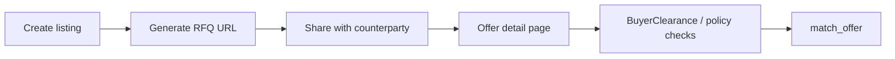

# Shielded RFQ Flow

Relay uses an RFQ model because private markets and OTC desks need negotiation, not always continuous public liquidity.

## Listing

A seller creates a listing with terms such as:

- Asset type.
- Minimum price.
- Token amount or position size.
- Valuation cap where relevant.
- Transfer restriction mode.
- Settlement mode.
- Optional designated buyer for private listings.

The listing creates or updates BOLT components used by the protocol.

## Offer URL

After a listing is created, Relay can expose a direct URL for that RFQ.

The URL points to the placement detail page and can be shared with a buyer, desk, market maker, treasury counterparty, or issuer-approved participant.

```text
/trade_detail/:tradeId
```

The URL does not make private terms public. It routes the counterparty to the RFQ interface where the usual protocol checks still apply.



## Delegation

Relay delegates the relevant component state to a Private Ephemeral Rollup.

The protocol can keep `DealTerms` confidential inside the PER. Vesting-backed listings may also keep `AssetRegistry` delegated until final settlement preparation is complete.

## Buyer Clearance

Before a match executes, a buyer must have a valid `BuyerClearance` component.

Clearance can be global or scoped to a listing. It may include:

- Clearance type.
- Expiry.
- Listing scope.
- Authorized issuer.

## Matching

`match_offer` executes inside the TEE/PER path.

The system evaluates:

- Bid price.
- Seller constraints.
- Asset type.
- Buyer clearance.
- Settlement status.
- Transfer consent where required.
- Payment routing policy.

## Settlement

If the match succeeds, Relay routes payment and commits final ownership state back to Solana.

`DealTerms` remains confidential by default.
